### Some useful formulas

**&pi; = 3.14**

##### Equation of a line

##### Compound Interest

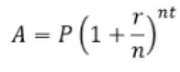

A = future value  
P = starting principal  
r = annual interest rate  
n = number of times interest is compounded yearly
t = number of years

##### Circle

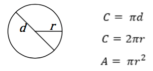

##### Rectangle

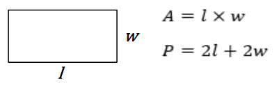

##### Sphere

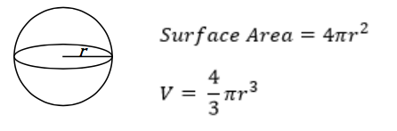

##### Trapezoid

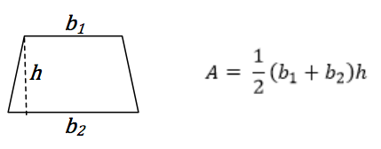

##### Cylinder

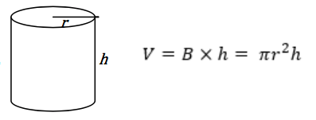

##### Parallelogram

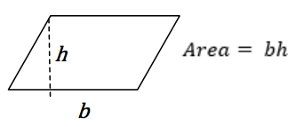

##### Surface Area

##### Rectangular Prism

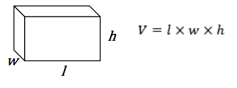

##### Cone

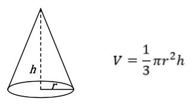

##### Cube

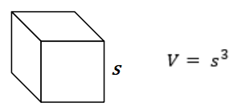

##### Pythagorean Theorem (right trangle)

##### Triange

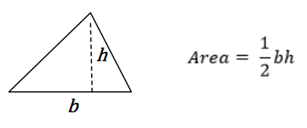
