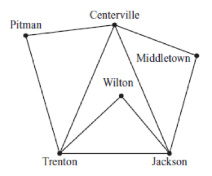

The pilot wants to fly from Middletown to Wilton, with no more than 2 stops in between. That allows up to three stops, with the final one being Wilton.

This diagram is called a tree diagram. From each stop, the branches of the tree show all the possible next stops.

Starting at Middletown, the pilot's first stop can be either Centerville or Jackson.

If the first stop is Centerville, there are four possibilities for stop 2: Pitman, Trenton, Jackson, and Middletown. Of those, only Trenton and Jackson connect directly to Wilton.

If the first stop is Jackson, there are four possibilities for stop 2: Trenton, Wilton, Centerville, and Middletown. If the flight is to Wilton, then we're done! Of the other three, only Trenton connects directly to Wilton.

That gives us four possible routes to get from Middletown to Wilton in
three stops or less.

This is choice D.

The tree diagram is a useful tool for solving problems that require a
list of all possible combinations of several options. You can see lots
of examples of other types of diagrams, as well as tables and other
tools for solving problems, here:
<http://www.mathinaction.org/problem-solving-strategies.html>

An extensive list of math problem solving strategies is here:
<https://www.une.edu.au/about-une/academic-schools/bcss/news-and-events/psychology-community-activities/over-fifty-problem-solving-strategies-explained>
