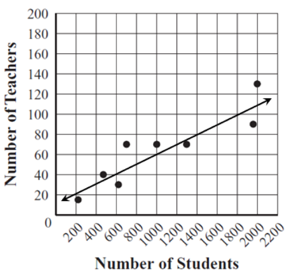

In a scatterplot like the one shown here, the *line of
best fit* is the line that can be drawn through the points that comes
closest to the pattern of the points overall. This question is asking
you to draw the best line you can through the cloud of points, which
would look approximately like the line shown here.

That line identifies the pattern of the relationship between *x* (Number
of Students) and *y* (Number of Teachers). Based on that line, for a
school of 1600 students (*x* = 1600), we can see that the approximate
value of *y* is *y =* 90 teachers.

You can learn more about scatterplots and lines of best fit here:
<http://www.mathsisfun.com/data/scatter-xy-plots.html>
