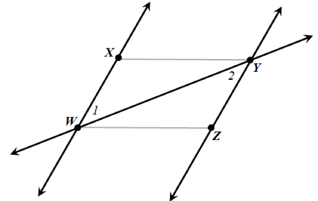

If *WXYZ* is a parallelogram, we know a few things about
it. In particular, its opposite sides are parallel, so
$\overset{\overline{}}{\text{WX}} \parallel \ \overset{\overline{}}{\text{ZY}}$.
The diagonal of the parallelogram, $\overset{\overline{}}{\text{WY}}$,
forms what is called a *transversal* between the two parallel lines
$\overset{\overleftrightarrow{}}{\text{WX}}$ and
$\overset{\overleftrightarrow{}}{\text{ZY}}$, which is just a line that
crosses two parallel lines. This might be more clear if we embed
parallelogram *WXYZ* in the following diagram:

When a transversal crosses two parallel lines, many pairs of *congruent
angles* (angles that are the same size) are formed. In particular, the
*alternate interior angles* $\measuredangle 1$ and $\measuredangle 2$
are congruent. These two angles are the angles the question asks about,
$\measuredangle XWY$ and $\measuredangle ZYW$. This tells us that
$\measuredangle XWY \cong \measuredangle ZYW$ because they are formed
from two parallel lines cut by a transversal, which is described in
choice C.

When two parallel lines are cut by a transversal, it is also true that
*corresponding angles* are congruent (described in choice A), and
*alternate exterior angles* are congruent (described in choice D). But
the two angles we are asked about are alternate interior angles, so C is
the correct choice.

A parallelogram is a special kind of quadrilateral, which is a
four-sided shape. Rectangles, squares, and trapezoids are other types of
quadrilaterals. You can review quadrilaterals, including parallelograms,
and their properties here:
<http://mathantics.com/section/lesson-video/quadrilaterals>

And for a review of parallel lines and their properties:
<http://www.mathsisfun.com/geometry/parallel-lines.html>
