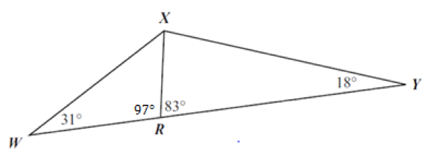
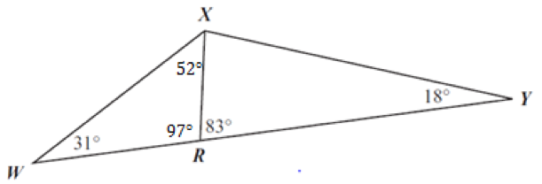

Any two angles that combine to form a straight line are
called supplementary angles. \( \measuredangle WRX \) and \( \measuredangle YRX \)
are supplementary angles, because they line up at point R to make a
straight line. Because they form a line, their measures add up to 180°.
Because of this, we can calculate the measure of \( \measuredangle WRX =
180° - 83° = 97° \), as shown in this figure:

We are asked to find the measure of \( \measuredangle WXR \), which is part
of triangle ΔWXR. In any triangle the measures of the three angles add
up to 180°. Since we know the size of two of the angles, we can write

$$31 + 97 + m\measuredangle WXR = 180$$

$$128 + m\measuredangle WXR = 180$$

Subtract 128° from both sides to find \( m\measuredangle WXR = 52 \), as
shown in this picture

This is choice A.

You can review properties of angles and triangles here, and be sure to
experiment with the interactive displays:
<http://www.mathsisfun.com/triangle.html> and
<http://www.mathsisfun.com/geometry/supplementary-angles.html>
