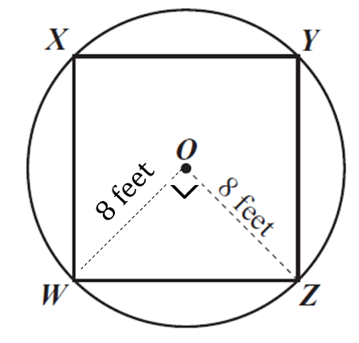

Since *O* is a circle, every radius is equal, so we can
draw in radius \( \overset{\overline{}}{\text{OW}} \), which would also
measure 8 feet. The two radii in the picture form a right triangle,
\( WOZ \). In that triangle, \( \measuredangle WOZ \) is the right angle, and
\( \overset{\overline{}}{\text{WZ}} \) is the hypotenuse

Since it is a right triangle, the lengths of the sides have to satisfy
the Pythagorean theorem, which says

$$a^{2} + b^{2} = c^{2}$$

Using the values from this right triangle gives us

$$8^{2} + 8^{2} = {(WZ)}^{2}$$

$$64 + 64 = {(WZ)}^{2}$$

$$128 = {(WZ)}^{2}$$

Find the square root of each side, to find

$$\sqrt{128} = WZ$$

$$11.3 = WZ$$

The length of side *WZ* is 11.3 feet.

Choice B.

Read more about the Pythagorean theorem here:
<http://www.mathsisfun.com/pythagoras.html>

You can review properties of circles here:
<http://www.mathsisfun.com/geometry/circle.html>

And general problem-solving strategies here: You can review a range of
problem-solving strategies, including drawing pictures, recognizing
patterns, and making tables, here:
<http://www.mathinaction.org/problem-solving-strategies.html>
