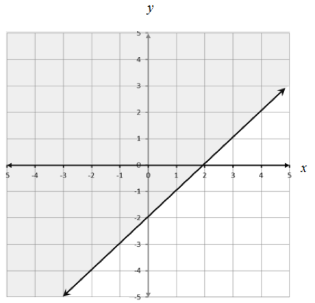
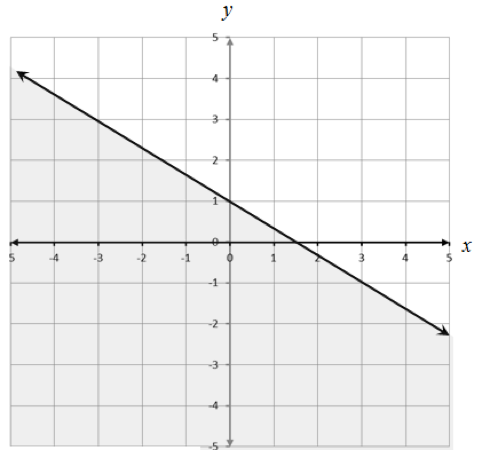

The graph of *y ≥ x – 2* is the entire region where the
*y* value *is bigger than or equal to* the *y*-value from the line *y =
x-2*. It looks like this:

The graph of $y \leq - \frac{2}{3}x + 1$is the entire region where the
*y* value *is less than or equal to* than the *y*-value from the line
$y = - \frac{2}{3}x + 1$. It looks like this:

The part of the graph where the two shaded areas overlap is set of x-y
values that satisfy both inequalities. This overlap region is the
solution to the system of inequalities. That overlap is shown in choice
A.

You can review graphing inequalities here:
<http://www.mathsisfun.com/algebra/graphing-linear-inequalities.html>

And systems of inequalities are explained here:
<http://www.virtualnerd.com/algebra-1/systems-equations-inequalities/inequalities/solving-systems-inequalities/definition-solution-system-linear-inequalities>
