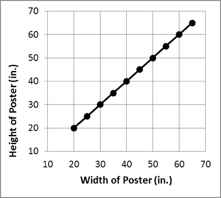

The scatterplots show the height of each poster on the
y-axis, and the width of each poster on the x-axis. Each point on the
graph represents one poster. Since Janice's posters all have a larger
height than width, then each point should have a y-value that is larger
than its x-value. If the heights were equal to the widths, then the
points would all fall on the line y=x, like shown in this graph:

If a point falls above that line, then the height is larger than the
width. If a point falls below the line, then the height is less than the
width.

Only Graph D has all the points above that line, showing that all the
posters have heights larger than their widths.

You can learn more about scatterplots here:
<http://www.mathsisfun.com/data/scatter-xy-plots.html>

And about linear equalities, when we know something about y being
greater than or less than x, here:
<http://www.mathsisfun.com/algebra/graphing-linear-inequalities.html>
