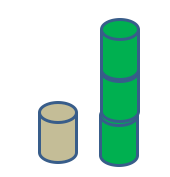

The volume of a cylinder is calculated as

$$V = A \times h$$

A is the area of the base of the cylinder, and h is its height.

Since the cans both have the same radius, the area of the base (A) is
the same for both cans. Since the height of the green can is 3 times the
height of the silver can and the areas of their bases are the same, then
the green can has 3 times the volume of the silver can (choice D). You
can see this in a picture:

The volume of a cylinder is a measure of how much space it contains. You
can think of it as how much liquid would fit in the can. Since the green
can is three times as tall, but the same width as the silver can, the
green can can hold three times the amount of liquid. You can review the
concepts of area and volume of some common solid shapes here:
<http://mathantics.com/index.php/section/lesson/volume>
