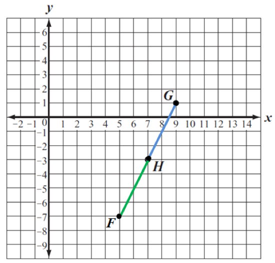

In order for H to be the midpoint of
$\overset{\overline{}}{\text{GF}}$, we can draw the segment the segment
$\overset{\overline{}}{\text{GH}}$ (shown in blue below) and then
duplicate it, for the same length and in the same direction, to draw the
segment $\overset{\overline{}}{\text{HF}}$ (shown in green). Since *GH =
HF*, we know that *H* is the midpoint of
$\overset{\overline{}}{\text{GF}}$.

Then read from the graph that the coordinates of ***F*** are (5, -7).
You can also verify that to move from ***G*** to ***H***, we have to
move left 2 and down 4, so to move from ***H*** to ***F*** we have to
move left 2 and down 4.

To learn more about plotting points on the *coordinate plane*, also
called Cartesian coordinates after the mathematician and philosopher
Rene Descartes, see:
<http://www.mathsisfun.com/data/cartesian-coordinates.html>
