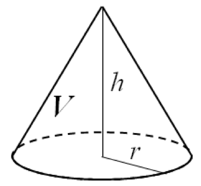

Remember that a right circular cone looks just like an
ice-cream cone. In this picture, *h* is the height of the cone, and *r*
is the radius of its circular base.

The volume of this right circular cone is 39 cubic inches, and its
radius is 2 ½ inches. The volume of a circular cone is calculated from
the formula

$$V = \ \frac{1}{3}\pi r^{2}h$$

We can use π=3.14, and substitute the information we know into this
formula.

$$39 = \ \frac{1}{3} \bullet 3.14 \bullet {2.5}^{2} \bullet h$$

Now we have an equation with one unknown, the variable *h.* Our
objective is to find the value of *h*, by getting it by itself on one
side of the equation. (We can do this in several ways—the way outlined
here is just one possible way to do this.)

Remembering the correct order of operations, we have to evaluate the
exponent first. Since 2.5^2^ = 6.25, we can write

$$39 = \ \frac{1}{3} \bullet 3.14 \bullet 6.25 \bullet h$$

And now we can multiply the three numbers on the right side of the
equation. Since $\ \frac{1}{3} \bullet 3.14 \bullet 6.25 = 6.54$, our
equation becomes

$$39 = \ 6.54 \bullet h$$

To get h by itself, divide both sides by 6.54, to find that h = 5.96.
Looking at the answer choices, this is closest to 6 inches (choice C).

You can learn more about cones here:
<http://www.mathsisfun.com/geometry/cone.html>

And to review solving an equation for an unknown variable, see:
<http://mathantics.com/index.php/section/lesson/solving_2step_equations>

Or

<http://www.virtualnerd.com/pre-algebra/inequalities-multi-step-equations/equations/solve-multiple-step-equations/order-of-operations-in-reverse>
