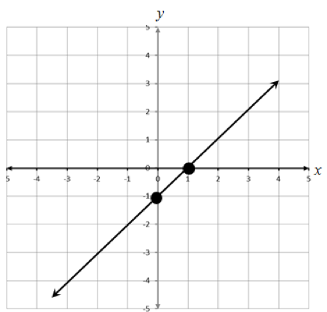

The graph we are shown has two important elements: the line that defines
the boundary between the shaded and unshaded region, and the shaded
region itself.

First, let’s look at the line itself.

To write the equation of a line, we need to know its slope and its
y-intercept. To find the slope, we can use the formula

$$Slope = \frac{\text{change in y}}{\text{change in x}}$$

Or in more mathematical terms

$$m = \frac{y_{2} - y_{1}}{x_{2} - x_{1}}$$

Which is calculated using any two points on the line, (x~1~, y~1~) and
(x~2~, y~2~). An important property of a linear function is that its
rate of change is constant, so we can pick any two points on the line,
and the calculation of the slope (the rate of change) will be the same.
From looking at the graph, we see two points that the line goes through
are (0,-1) and (1,0), which we labeled in the graph with the two dots.

Using these two points, the slope is

$$m = \frac{0 - - 1}{1 - 0} = \frac{0 + 1}{1} = 1$$

The y-intercept of the line is the value of y where the line crosses the
y-axis. In this graph, we see that the y-intercept is b=-1. Using the
slope-intercept form of the equation of the line, we can write the
equation as

$$y = mx + b$$

$$y = 1x - 1$$

Or just

$$y = x - 1$$

Now we have to determine the inequality that represents the shaded
portion of the graph. Since the area below the line is shaded, the
inequality includes all values of y that are below the line, or less
than x-1. Because it is a solid line, the inequality includes the line
itself, so the inequality shown is \( y \leq x - 1 \) which is choice 4.

If the line was shown as a dotted line, that would tell us that the
inequality does not include the line itself, which would be written as
is \( y < x - 1 \), which is choice 3. Choices 1 and 2 represent the
situation where the shaded region is above the line, indicating that we
are including all values of y that are greater than the line.

You can learn more about graphing lines here:
<http://www.mathsisfun.com/equation_of_line.html> where you can
experiment with the graphs of different lines using the dynamic graphing
calculator, and inequalities here:
<http://www.mathsisfun.com/algebra/graphing-linear-inequalities.html>
