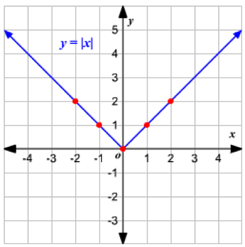

The graph of the absolute value function y = |x| looks
like this:

Replacing x by x-2 moves the function two spaces to the right, as shown
in choice 4. You can see more about graphs of the absolute value
function and its *translations* (movements) here:
<http://hotmath.com/hotmath_help/topics/absolute-value-functions.html>
